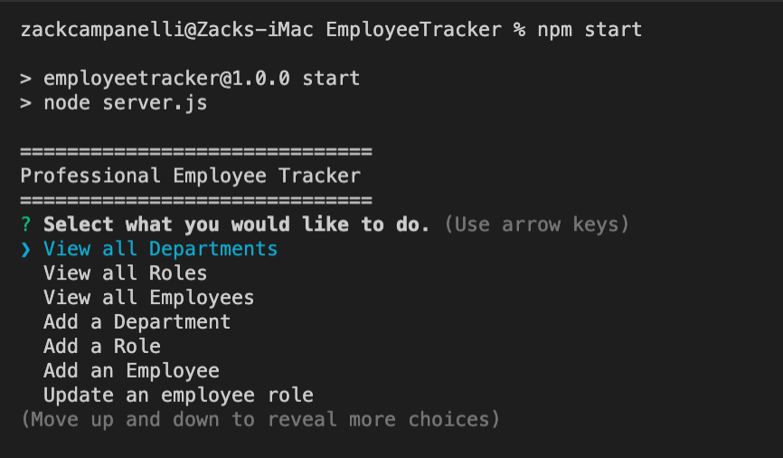
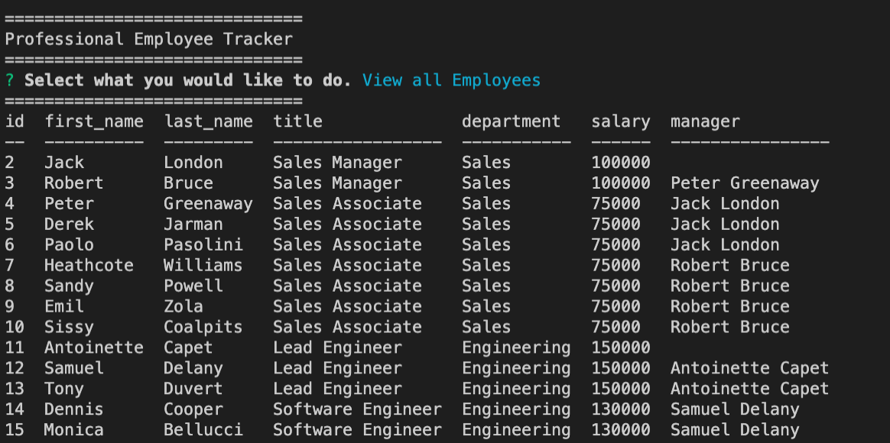
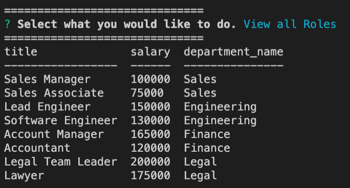

# Professional Employee Tracker

## Description

A command-line program that allows the user to manage all the employees, roles, and departments within a company

## Table of Contents

- [Installation](#Installation)
- [Usage](#Usage)
- [License](#License)
- [Credits](#Credits)
- [Questions](#Questions)

## Installation

Clone this repository to your machine. Open a command line at the root folder of the repository and run `npm install` in order to install all dependencies. To populate the database, log into mysql from the root folder and run `source db/db.sql` to create the database. Then run `source db/schema.sql` to create the tables. Optionally, you may run `source db/seeds.sql` to populate the database with pre-defined employees.

## Usage

From the command line at the root folder, run `npm start` to begin the application. From there you can navigate to the different options the application offers

## License

A short and simple permissive license with conditions only requiring preservation of copyright and license notices. Licensed works, modifications, and larger works may be distributed under different terms and without source code.

## Questions

If you have any questions, concerns, or comments, feel free to contact me:

-GitHub: [Zacharycampanelli](https://github.com/Zacharycampanelli)  
-Email: [zaccamp@optonline.net](mailto:zaccamp@optonline.net)

## Video Tutorial

[Tutorial link here](https://drive.google.com/file/d/19Eu73_y415Kf5zu9HhNJkfhCJqHP9BYB/view)
